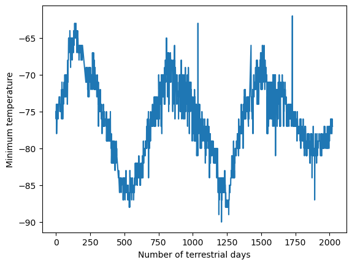

# Mars Scraping Analysis

## Website: 
[website](https://github.com/mattcat1221/Mars-Scrapping-Analysis)

## Description
 For this project. First, I scraped the titles and a little bit of the text from news articles about Mars. Second,  I collected and studied the weather information for Mars, which is listed in a table.

## Table of Contents
- [Installation](#installation)
- [Usage](#usage)
- [Credits](#credits)
- [License](#license)
- [Features](#features)

- [Contact](#contact)

## Installation
Chrome, chrome driver, splinter(selenium 4), html 5 lib and lxml  

## Usage
Educational 

## Credits
Casey Matthews 

## License
MIT

## Features
Splinter, a tool that automates our web browser actions, which allows us to automatically scan and repeat interactions on websites. ChromeDriver, which enables automation in the Chrome browser. Beautiful Soup, a Python library that allows you to pull out and parse specific information from a webpage. html5lib and lxml, which are packages that Beautiful Soup uses to parse websites.

## Contact
If there are any questions of concerns, I can be reached at:
##### [github: matcat1221](https://github.com/matcat1221)
##### [email: caseyvmatthews@gmail.com](mailto:caseyvmatthews@gmail.com)

